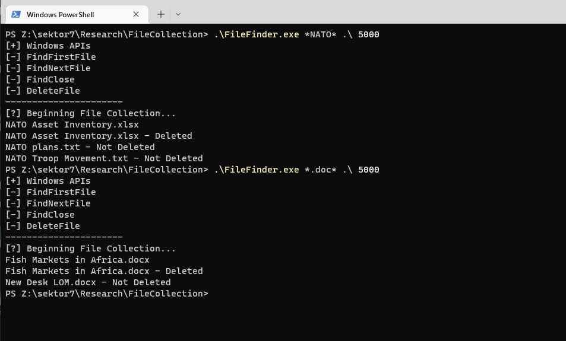

# File Collection

`FileFinder.exe` is a command-line utility that emulates part of Turla's LightNeuron collection capabilties. It takes in a filename, a file path, and a sleep time in milliseconds. After which it will find the first matching filename, print it to console, and then delete it. It will continue iterating and displaying all other matches without deleting them.

`FileFinder.exe` primarly makes use of the following Windows APIs:
- FindFirstFile
- FindNextFile
- FindClose
- DeleteFile

## Usage
```
FileFinder.exe *SECRET* .\ 5000
```

