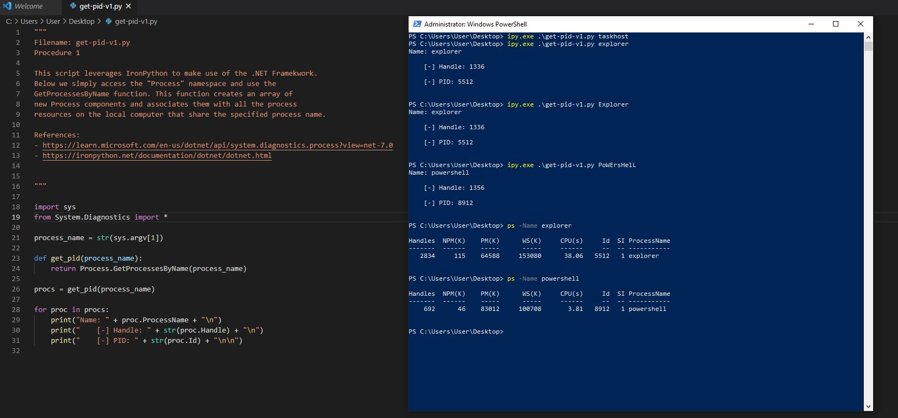

# C# Method

Here we utilize the C# method by using the `GetProcessesName` method. `GetProcessesName` returns an array of new Process components and associates them with all the process resources on the local computer that share the specified process name. From the array we print the `Name`, `Handle`, and `Id` properties.

